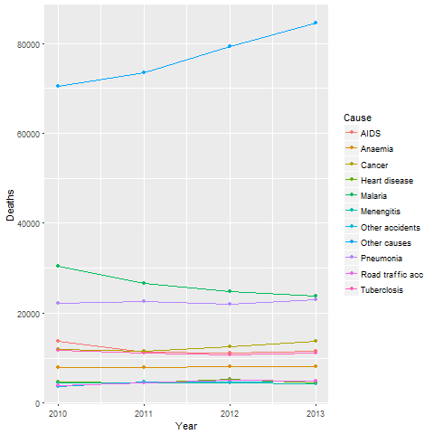

Introduction
------------

This is an exploration of dataset consisting number of deaths caused by
major diseases.  
The data is available to the public here
<https://data.humdata.org/dataset>.

Before we start any data exploration and analysis lets lets load all the
library we will need for our exploration.

    library(dplyr)

    ## 
    ## Attaching package: 'dplyr'

    ## The following objects are masked from 'package:stats':
    ## 
    ##     filter, lag

    ## The following objects are masked from 'package:base':
    ## 
    ##     intersect, setdiff, setequal, union

    library(tidyr)
    library(readr)
    library(ggplot2)

Now our environment is ready for us to dive into work.

We start by creating a directory where we will store our data.

    if (!file.exists("data")){
      dir.create("data")
    }

Then move to the source of our dataset and get the link which we will
use to download the data into our working machine.

    file_url <- "https://data.humdata.org/dataset/800a36ce-3dac-4266-9afc-6233ec2f3bd5/resource/9aa2b2eb-5a34-4fbf-bd62-e605dbaf3400/download/national-registered-deaths-by-major-causes-2010-2013.csv"  

    if (!file.exists("./data/dat1.csv")){
      download.file(file_url, destfile = "data/dat1.csv") 
      downloadtime <- date()
    }

Each time we download data from internet it is a good practice to record
the time we download, this help you in future when you redownload the
data and find it has being updated.

    #print (downloadtime)

Lets read the data into R.

    mydf1 <- read.csv("./data/dat1.csv")

Now lets explore our data.

    class(mydf1)

    ## [1] "data.frame"

    dim(mydf1)

    ## [1] 11  5

    head(mydf1)

              Cause  X2010 X2011 X2012 X2013
    1          AIDS  13656 11274 11111 11448
    2       Anaemia  7985  7984  8169  8124
    3        Cancer  11995 11527 12574 13720
    4 Heart disease  4634  4404  5188  4544
    5      Malaria   30505 26652 24772 23789
    6    Menengitis  4371  4497  4480  4265

Now we can see.  
+ We have a dataframe as our R object  
+ We have five column with rows  
+ The first column is the main diseases while the rest are years and t
he number of deaths for each disease.

Tidy Data
---------

Like families, tidy datasets are all alike but every messy dataset is
messy in its own way. Tidy datasets provide a standardized way to link
the structure of a dataset (its physical layout) with its semantics (its
meaning). In **tidy data**  
1. Each variable forms a column. 2. Each observation forms a row. 3.
Each type of observational unit forms a table.

These principles of tidy data provide a standard way to organise data
values within a dataset. A standard makes initial data cleaning easier
because you don't need to start from scratch and reinvent the wheel
every time.  
Back to our data we can clearly conclude that its quite messy thus we
need to make it tidy.  
From the data we have three variables that is  
+ Cause  
+ Year  
+ Deaths  
This means that the data violate the rule that tidy data each variable
form a column.  
Lets dive in to achieve this using the dplyr and tidyr package.  
We begin by using "tbl\_df" in dplyr package that create a dataframe
that ffers better checking and printing capabilities than traditional
data frames.

    mydf <- tbl_df(mydf1)
    class(mydf)   

    [1] "tbl_df"     "tbl"        "data.frame"   

    mydf   

     A tibble: 11 × 5   
                   Cause X2010 X2011 X2012 X2013   
                  <fctr> <int> <int> <int> <int>   
     1              AIDS 13656 11274 11111 11448   
     2           Anaemia  7985  7984  8169  8124   
     3            Cancer 11995 11527 12574 13720   
     4     Heart disease  4634  4404  5188  4544   
     5           Malaria 30505 26652 24772 23789   
     6        Menengitis  4371  4497  4480  4265   
     7   Other accidents  3757  4726  4630  4857   
     8      Other causes 70389 73425 79228 84539   
     9         Pneumonia 22204 22632 22051 22918   
     10 Road traffic acc  3892  4382  4997  4942   
     11      Tuberclosis 11712 11149 10611 11186    

Nice the new dataframe provide us with more info neatly.

Further to avoid any confusion remove the former dataframe.

    rm(mydf1)

Next we will utilise gather function tidyr package to clean the messy
data.

    tidy_mydf <- gather(mydf, Year, Deaths, -Cause)
    dim(tidy_mydf)

    ## [1] 44  3

    tidy_mydf

    ## # A tibble: 44 × 3
    ##               Cause  Year Deaths
    ##              <fctr> <chr>  <int>
    ## 1              AIDS X2010  13656
    ## 2           Anaemia X2010   7985
    ## 3            Cancer X2010  11995
    ## 4     Heart disease X2010   4634
    ## 5           Malaria X2010  30505
    ## 6        Menengitis X2010   4371
    ## 7   Other accidents X2010   3757
    ## 8      Other causes X2010  70389
    ## 9         Pneumonia X2010  22204
    ## 10 Road traffic acc X2010   3892
    ## # ... with 34 more rows

Greate we now got three column this, data is tidy. But a closer look at
Year column each year is proceeding by a letter x which is not very
neat. Lets combine parse\_number function in readr package and mutate in
dplyr.

    tidy_mydf <- mutate(tidy_mydf, Year = parse_number(Year))
    tidy_mydf

     A tibble: 44 × 3
                   Cause  Year Deaths
                  <fctr> <dbl>  <int>
     1              AIDS  2010  13656
     2           Anaemia  2010   7985
     3            Cancer  2010  11995
     4     Heart disease  2010   4634
     5           Malaria  2010  30505
     6        Menengitis  2010   4371
     7   Other accidents  2010   3757
     8      Other causes  2010  70389
     9         Pneumonia  2010  22204
     10 Road traffic acc  2010   3892
     ... with 34 more rows

Finally we have the Tidy data ready for further analysis lets write and
save in a file for future use.

    write.csv(tidy_mydf, file = "data/tidy_dat1.csv")

Including Plots for visualization
---------------------------------

For a visual of the data let utilize ggplot2 package to embed a simple
plot.
<h3>plot<h3>    

